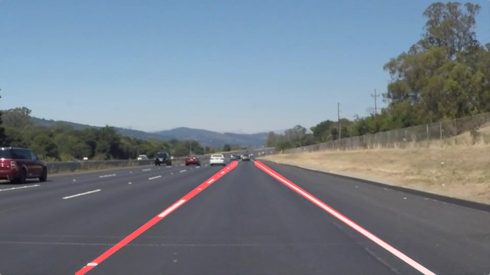

# Lane Finding

[](https://github.com/FelipeZerokun/SDCE-01-Finding-Lane-Lines-Python/actions/workflows/ci.yml)

[](LICENSE)

A configurable computer-vision pipeline for detecting road lane lines in images and videos. The project uses OpenCV for image processing, MoviePy for video handling, and `uv` for reproducible Python environments and dependency management.



This repository began as the first project in Udacity's Self-Driving Car Engineer Nanodegree and has since been modernized into a typed, tested Python package with a command-line interface.

## Related implementation

A separate [C++17 and OpenCV implementation](https://github.com/FelipeZerokun/SDCE-01-Finding-Lane-Lines-CPP) is available for comparing the same lane-detection problem across both languages and their development ecosystems.

## Features

- Detects left and right lane boundaries in RGB road images.
- Processes individual images and complete MP4 videos.
- Smooths lane estimates across video frames.
- Supports validated TOML configuration.
- Refuses accidental output overwrites unless explicitly allowed.
- Uses a reproducible Python 3.12 environment and lockfile.
- Includes unit tests, strict type checking, linting, formatting checks, package builds, and continuous integration.

## Detection pipeline

Each frame passes through the following stages:

1. Convert the RGB image to grayscale.
2. Apply Gaussian smoothing to reduce image noise.
3. Detect edges with the Canny algorithm.
4. Restrict detection to a configurable road region of interest.
5. Find candidate line segments with the probabilistic Hough transform.
6. Filter segments by slope and horizontal position.
7. Fit a length-weighted line to each side of the lane.
8. Smooth lane positions across recent video frames.
9. Draw the detected lanes over the original frame.

## Requirements

- Python 3.12 or newer
- [`uv`](https://docs.astral.sh/uv/)
- Git

Python and all project dependencies are resolved from `.python-version`, `pyproject.toml`, and `uv.lock`.

## Installation

Clone the repository and enter its directory:

```console
git clone https://github.com/FelipeZerokun/SDCE-01-Finding-Lane-Lines-Python.git
cd SDCE-01-Finding-Lane-Lines-Python
```

Install the requested Python version and synchronize the development environment:

```console
uv python install
uv sync --dev
```

`uv` creates and manages a local `.venv` automatically. Commands can be run with `uv run`, so activating the virtual environment is optional.

To include JupyterLab and Matplotlib for the historical notebook:

```console
uv sync --all-groups
```

## Usage

### Process an image

```console
uv run lane-finding image test_images/solidWhiteCurve.jpg \
  --output outputs/solidWhiteCurve.png
```

### Process a video

```console
uv run lane-finding video test_videos/solidWhiteRight.mp4 \
  --output outputs/solidWhiteRight.mp4
```

The output directory is created when necessary. Existing output files are protected by default; pass `--force` to replace one:

```console
uv run lane-finding image test_images/solidWhiteCurve.jpg \
  --output outputs/solidWhiteCurve.png \
  --force
```

Use `--help` to see all available commands and arguments:

```console
uv run lane-finding --help
uv run lane-finding image --help
uv run lane-finding video --help
```

On PowerShell, replace the trailing `\` characters in multiline examples with backticks, or enter each command on a single line.

## Configuration

The CLI uses a packaged default configuration, so it works independently of the current working directory. To customize the pipeline, copy or edit `configs/default.toml` and pass it explicitly:

```console
uv run lane-finding image test_images/solidYellowLeft.jpg \
  --output outputs/solidYellowLeft.png \
  --config configs/default.toml
```

Configuration is grouped by processing stage:

| Section | Purpose |
| --- | --- |
| `blur` | Gaussian kernel size |
| `canny` | Low and high edge-detection thresholds |
| `roi` | Relative coordinates for the road region of interest |
| `hough` | Hough-transform resolution and segment thresholds |
| `lanes` | Slope filtering, line extent, and temporal smoothing |
| `render` | Overlay weights and lane-line thickness |

Invalid values, missing sections, and malformed TOML are reported as command-line errors. The editable configuration and packaged default are tested to ensure that they remain identical.

## Development

Install every dependency group:

```console
uv sync --all-groups
```

Run the complete quality suite:

```console
uv run ruff format --check src tests
uv run ruff check src tests
uv run mypy src/lane_finding
uv run pytest
uv build
```

To apply formatting rather than check it:

```console
uv run ruff format src tests
```

Formatting is deliberately limited to `src` and `tests` so the archived submission and notebook remain unchanged.

GitHub Actions runs the same formatting, linting, typing, testing, and package-build checks on every push and pull request.

## Project structure

```text
configs/                    Editable pipeline configuration
legacy/                     Archived standalone implementation
src/lane_finding/           Modern application package
tests/                      Automated test suite
test_images/                Supplied image fixtures and historical results
test_videos/                Supplied video fixtures
.github/workflows/ci.yml    Continuous-integration workflow
P1.ipynb                    Original Udacity notebook
pyproject.toml              Metadata, dependencies, and tool configuration
uv.lock                     Reproducible dependency lockfile
```

## Limitations

This classical computer-vision pipeline assumes relatively clear, approximately straight lane markings within a predictable camera view. Performance may degrade with:

- Curved or heavily worn lane markings
- Strong shadows, glare, fog, rain, or low light
- Construction zones or unusual road markings
- Abrupt camera-position changes
- Vehicles or other objects obscuring the lane boundaries

The detector is intended as an educational demonstration, not as a production vehicle-control system.

## Legacy project

The original Udacity implementation remains available in [`P1.ipynb`](P1.ipynb), with its exported standalone script preserved under [`legacy/Project01_RojasFelipe.py`](legacy/Project01_RojasFelipe.py). These files are retained for historical comparison and are not used by the modern CLI.

## License

This project is distributed under the terms of the [MIT License](LICENSE).
